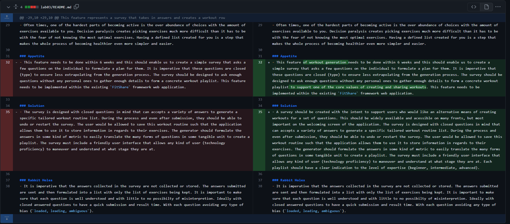

# SEG4105 - Delierable 2

| Outline | Value |
| --- | --- |
| Course | SEG 4105 |
| Date | Fall 2023 |
| Student | Andy Ung, aung015@uottawa.ca |
| TA | Shabnam Hassaniahari, shass126@uottawa.ca   Ali Mirferdos , smirf045@uottawa.ca| 
| Professor | Andrew Forward, aforward@hey.com |  
| Team | Andy Ung 300117710  |

Winning Pitch: `Workout Generation` by Andy Ung

Message: This is to thank everyone for creating and participating in yesterdays Pitch and Betting process. They provided useful insight in determining next steps and things to consider for the FitShare application. With that being said, there could only be one winner to fit into the next 6-week development cycle. Workout Generation by Andy Ung. Going forward for this 6-week cycle, we will be tackling implementing a workout generation feature to support the FitShare application. This is to support our users of creating workouts and routines that can be shared. The pre-existing framework will remain intact, but new additions to both front and back-end will need to be incorporated.

Changelog: Reformulating the appetite & solution

Meeting minutes: [Minutes](https://github.com/LukaDavid04/FitShare/blob/main/Minutes.md#meeting-date-2023-10-12)