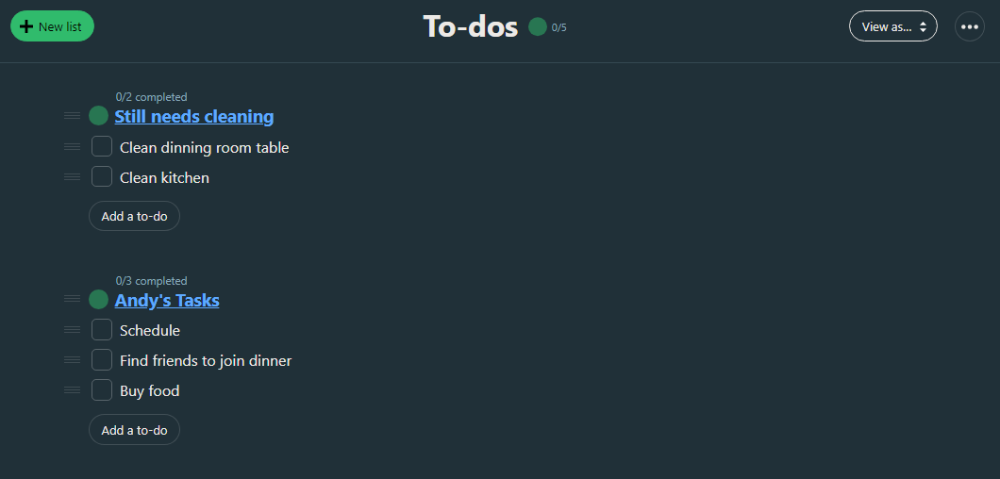
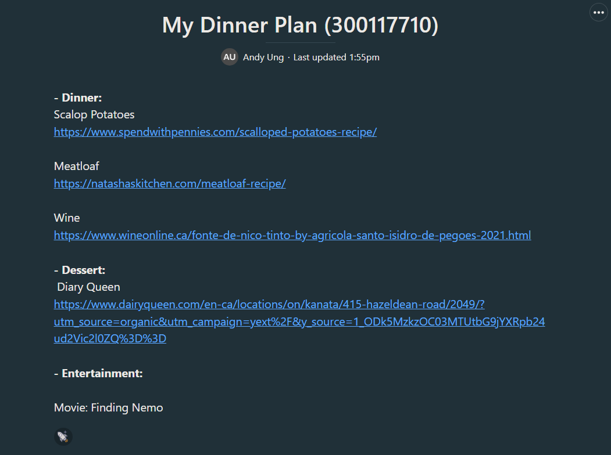

# SEG4105 - Lab 2

| Outline | Value |
| --- | --- |
| Course | SEG 4105 |
| Date | Fall 2023 |
| Student | Andy Ung, aung015@uottawa.ca |
| TA | Shabnam Hassaniahari, shass126@uottawa.ca   Ali Mirferdos , smirf045@uottawa.ca| 
| Team | Andy Ung 300117710  |

## To-do List

## Dinner Plan
