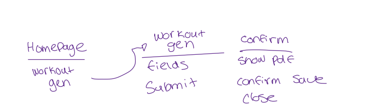
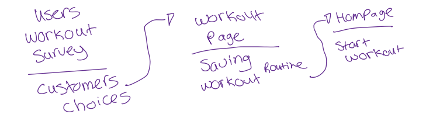

# SEG4105 - Lab 3

| Outline | Value |
| --- | --- |
| Course | SEG 4105 |
| Date | Fall 2023 |
| Student | Andy Ung, aung015@uottawa.ca |
| TA | Shabnam Hassaniahari, shass126@uottawa.ca   Ali Mirferdos , smirf045@uottawa.ca| 
| Professor | Andrew Forward, aforward@hey.com |  
| Team | Andy Ung 300117710  |

## Feature - Workout Generation
This feature represents a survey that takes in answers and creates a workout routine split that reflects specific choices made. This accomdates certain restrictions and preferences provided from the user and creates user specific workout routines to ensure maximium satisfaction and performance. The goal is to allow any kind of user (any level of expertise) 

## Breadboarding
### Stage 1

### Stage 2 (Refined)

## Shaping Work
### Problem
- Often times, one of the hardest parts of becoming active is the over abundance of choices with the amount of exercises available to you. Decision paralysis creates picking exercises much more difficult than it has to be with the fear of not knowing the most optimal exercises. Having a defined list is a step that makes the whole process of becoming healthier even more simpler.  

### Appetite
- This feature needs to be done within 6 weeks and this should enable us to create a simple questionnaire that asks a few questions on the individual to formulate a plan for them. The questionnnaire should be designed to ask enough questions without any personal ones to gather enough details to form a list. This feature needs to be implemented within the existing `FitShare` framework web application.

### Solution
- A survey that is formulated as a questionnaire and accepts a variety of answers to generate a specific tailored workout routine list. The user would be allowed to save this workout routine such that the application allows them to use it to store information in regards to their exercises. During the process and even after submission, they should be able to undo or restart the questionnaire. The questionnaire must include a friendly user interface that allows any kind of user (technology proficiency) to maneuver and understand at what stage they are at. 

### Rabbit Holes
- It is imperative that the answers collected in the survey are not collected or stored. The answers submitted are sent and then formulated into a list with only the list of exercises being kept. It is important to make sure that each question is well understood and with little to no possibilty of misinterpreting it. Ideally with closed answered questions to have a quick submission and result time. With each question avoiding any type of bias (`loaded, leading,  ambiguous`). 

### No Go's
- The workout generator should not take any consideration on previous workouts or goals in the decision process. Any questions relating to personal questions should be avoided as it is not necessary for this feature. 

