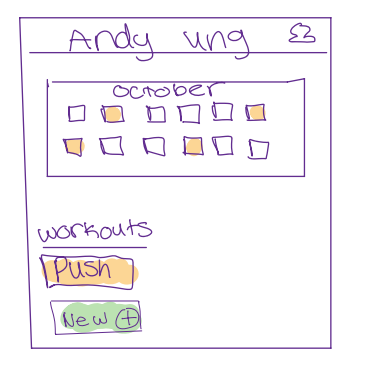
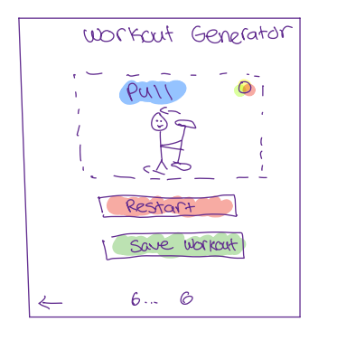
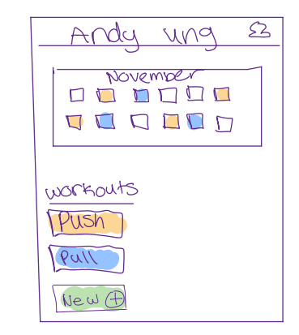

# SEG4105 - Lab 4

| Outline | Value |
| --- | --- |
| Course | SEG 4105 |
| Date | Fall 2023 |
| Student | Andy Ung, aung015@uottawa.ca |
| TA | Shabnam Hassaniahari, shass126@uottawa.ca   Ali Mirferdos , smirf045@uottawa.ca| 
| Professor | Andrew Forward, aforward@hey.com |  
| Team | Andy Ung 300117710  |

## Feature - Workout Generation
This feature represents a survey that takes in answers and creates a workout routine split that reflects specific choices made. This accomdates certain restrictions and preferences provided from the user and creates user specific workout routines to ensure maximium satisfaction and performance. The goal is to allow any kind of user (any level of expertise) 

## Fat Marker Sketches

