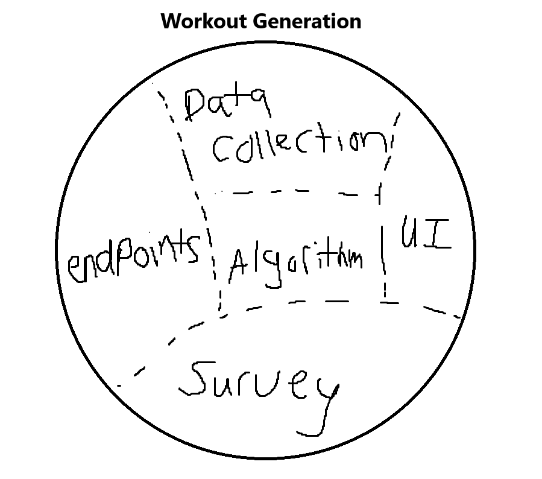
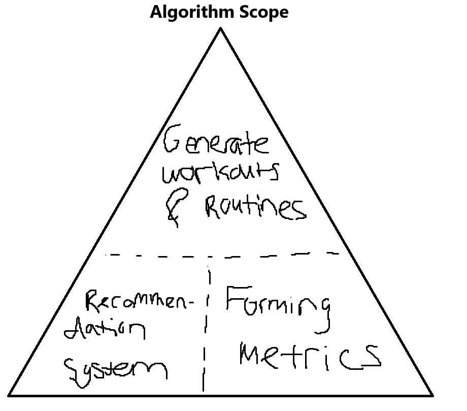
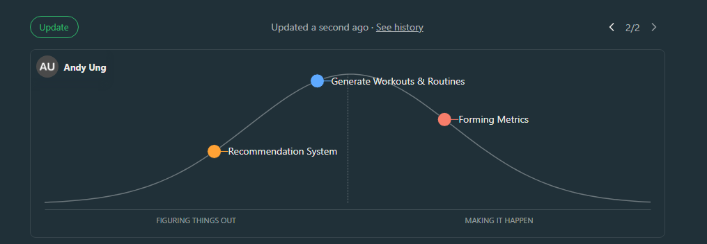
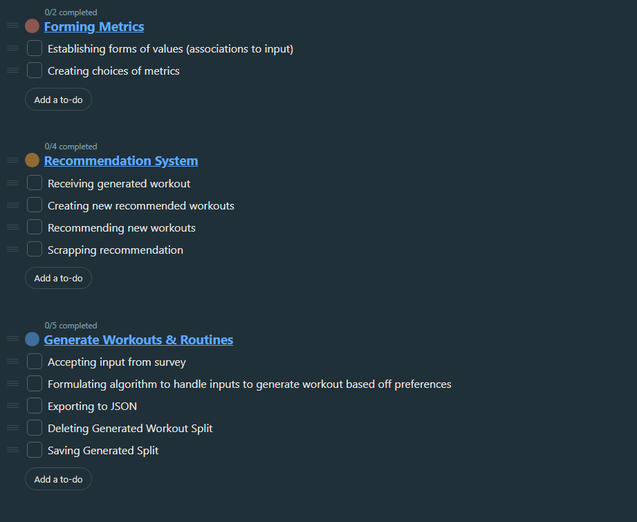

## Team Members

| Outline | Value |
| --- | --- |
| Course | SEG 4105 |
| Date | Fall 2023 |
| Student | Andy Ung, aung015@uottawa.ca |
| TA | Shabnam Hassaniahari, shass126@uottawa.ca   Ali Mirferdos , smirf045@uottawa.ca| 
| Professor | Andrew Forward, aforward@hey.com |  
| Team | Andy Ung 300117710   Khai Tran 300112587   Luka David 300134324 Avaneesh Madaram 300130329  Adhish Maheswaran 300133918 |

## Scope 
Algorithm - Andy
Endpoints - Luka
Survey - Adhish
User interface - Avaneesh
Data Collection - Khai 

## Start Mapping your Scope (Chapter 12)
### <strong>Algorithm</strong>

Workout Generation is broken down into 5-main components (scope)  
1. Endpoints
2. Data Collection
3. Algorithm
4. UI
5. Survey

### <strong>Tasks</strong>

The three main  features of the Algorithm Scope is 
- Generation of Workouts and Routines
    - Accepting input from survey
    - Formulating algorithm to handle inputs to generate workout based off preferences
    - Exporting to JSON
- Recommendation System
    - Receiving generated workout
    - Creating new recommended workouts
    - Recommending new workouts  
- Forming Metrics
    - Establishing forms of values (associations to input)
    - Creating choices of metrics  

## Map Tasks to Progress (Chapter 13)
### Stage 1 - Week 1

### Tasks
