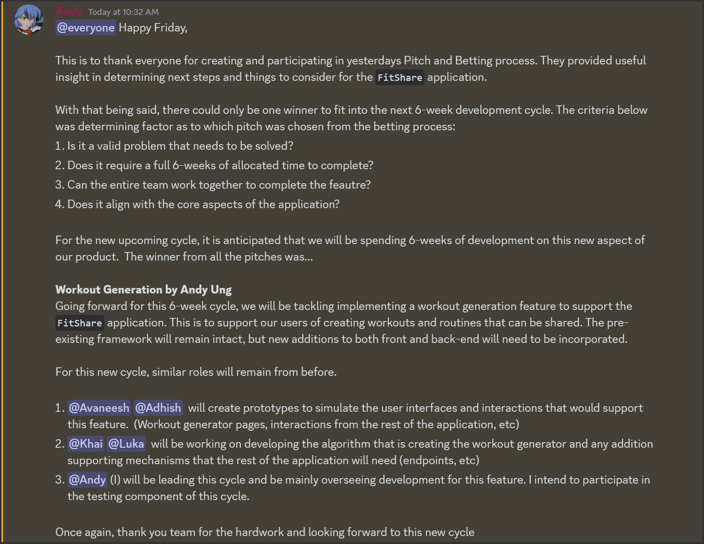

# Planning Your Betting Table

# SEG4105 - Tutorial 4

| Outline | Value |
| --- | --- |
| Course | SEG 4105 |
| Date | Fall 2023 |
| Student | Andy Ung, aung015@uottawa.ca |
| TA | Shabnam Hassaniahari, shass126@uottawa.ca   Ali Mirferdos , smirf045@uottawa.ca| 
| Professor | Andrew Forward, aforward@hey.com |  
| Team | Andy Ung 300117710  |

## Pitch Notes

### Khai - Sessions
- Having a centralized user inteface to interact with to establish a connection with working out
- Allows time to be measured such that individuals can monitor elapsed time to help better their progress 
- Ties into the exisiting `FitShare` application and needs to be completed with 6 weeks
- A interface that displays the current active session and shows real-time tracking
    - Pause and resume functionality of the timer
    - Updating interface when an exercise is completed
    - Shows previous sessions 
- Misses out outlining the potential of miss clicks on advancing to a new exercise when unintended
- Efficiency is a priority in ensureing this runs well
- No real-time sharing and analytics are not going to be incooperated into this feature

### Adhish - Calendar
- Users should have some sort of record when using the application
- These are important milestones to indicate and view progress to better themselves from before
- No current feature to access previous history
- Should be widely accessible to any user
- Requires skills in design for the widget with back-end needing knowledge on how to interpret and share such data. 
- Requires sessions to be completed which is a feature that is not incooperated
    - Means two feautres in one dev cycle
- A calender widget is the most intuitive for the user to view their history
- Should be interactable 
- Csv format should be supported and included to support local installation
- No using anthing 
Apple Health Kit related should not be considered  

### Avaneesh - Login
- Feature of authentication to allow users to save exercises and workouts to their personal account
- Completed within 6-weeks and should require two fields to sign in 
- The user interface should be simple and easy to use when entering information
- Should have some sort of encryption to allow for user data security
- Avoid making sign ups too easy or else accounts could get hacked 
- 2FA should be avoided for now

### Luka - Social
- The problem statement does not really suit the feature too well
    - More talking on the lines of a goal instead of the social aspect of sharing workouts
- User interface needs to simple and allow for friends and other users to be searched for
- Users should be able to view following worksouts
- Within their account page they should be able to view their following and followers
- Solution does not really outline the kinds of search parameters to find users
- Rabbit holes do not mention anything of the return value of the search results
- Should be easy to search for another user on the application
- No go's dont really make sense and instead should talk about the kinds of parameters that should not be taken into consideration  

## The Bet
- We did not choose Khai's pitch as we did not agree that it fundamentally agree with the main goal of the applications. The application first and foremost should be targeting features that support sharing works rather than incooperate new ideas that may hinder this aspect of the application. Although this is great for users that want to start workouts, fully fleshing and incooperating features that support or add sharing would be better.
- We did not choose Adhish's pitch as it was not necessarily a feature that would last a whole 6 weeks. As the cadence for our features wants to be aimed for 6 weeks. This feature seemed small in scope that the feature could be worked on after our year in review. In addition, it is dependent on sessions, which would make two features in one cycle.
- We did not choose Avaneesh's pitch as it was not necessarily a feature that expanded to the whoel 6 week cycle. As this feature only needed limited resources, dedicating a whole cycle would add un-need effort to the project that would be better spent better on another feature.  
- We did not choose Luka's pitch as it was a feature that was dependent upon having multiple users sharing workouts while that feature was not particularly fleshed out. Not to mention that the pitch was not clear on the intention of searching users to follow, and did not talk a bit more about saving as reference(s) or value.

## The Kickoff
