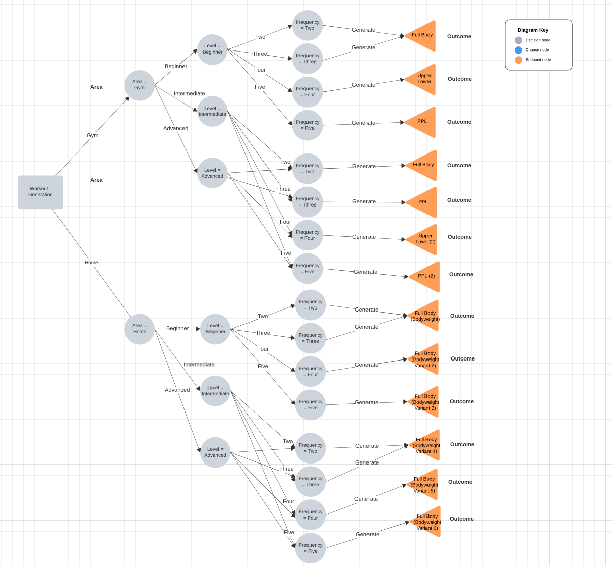
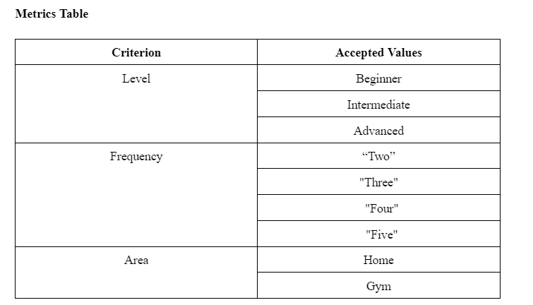

# SEG4105 - Tutorial 8

| Outline | Value |
| --- | --- |
| Course | SEG 4105 |
| Date | Fall 2023 |
| Student | Andy Ung, aung015@uottawa.ca |
| TA | Shabnam Hassaniahari, shass126@uottawa.ca   Ali Mirferdos , smirf045@uottawa.ca|
| Professor | Andrew Forward, aforward@hey.com |  
| Team | Andy Ung 300117710  |

## Images

## Notes
- MongoDB
    - Using Mongoose Schema to `fetch` the Collection 
    - Abide by the template for the desired outcome following the necessary metrics
    - Use `Push` to new exercises into schema to add onto the workout schema
    - When the entire workout schema has been made, use the template of the routine schema and instantiate the workout attribute to the schema 
    - Once that has been done return the routine schema (response)  

## Links: 

- [Diagram](https://lucid.app/lucidchart/4d86bfa0-ab8a-4016-9e11-8b4ab6cab7be/edit?viewport_loc=-583%2C119%2C1646%2C2044%2C0_0&invitationId=inv_80b194ef-1b38-4f94-9988-3bc612e01274)
- [Metrics Table + Exercise List](https://docs.google.com/document/d/1nkGb7L3meAjP4q1O1PhJN4kkbZCNPHTTSLLAWFwXKYk/edit?usp=sharing)